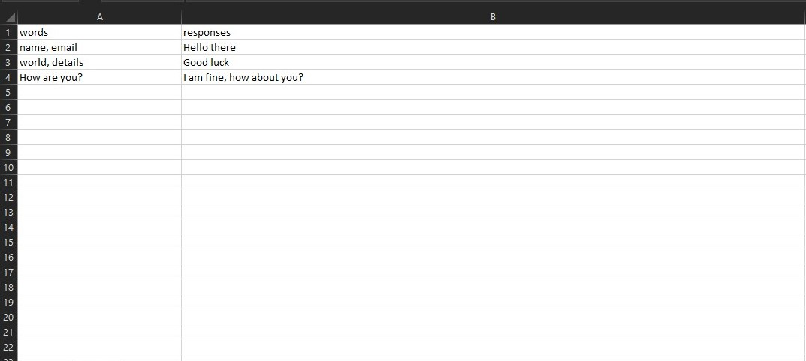
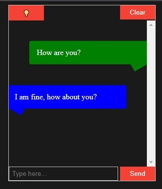

# Words Bot

#### A simple bot that replies to messages with the keywords given in the excel and its respective replies.

 

## How to use
* Clone the repository via `git clone https://github.com/ars-4/words-bot.git`
* Install the requirements via `npm install`
* Create an excel file with the keywords and its respective replies i.e. `commands.xlsx`
* Run the bot via `node main.js`
* Access the bot via `http://localhost:8000`
* Checkout the example.html file for the bot usage

 

## Sample Excel File

<a href="#">commands.xlsx</a>
| Keywords | Reply |
| --- | --- |
| hello, worlds | Hi there! |
| how are you | I am fine, thanks! |
| what is your name | I am a bot. |

<b>The requested sentence must have all keywords to reply. Multiple keywords can be used as `word_one, word_two` with ',[space]'.</b>

<b>Example:</b> <i>`Hello` there, how many `worlds` are out there?</i>
 
<b>Will reply:</b> <i>Hi there!</i>

 

## Sample HTML File

<a href="#">example.html</a>

